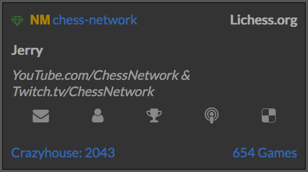

# Lichess widgets [](https://www.bithound.io/github/seanysean/lichess-widgets)
Originally made to practice using JSON.

## Usage
#1 Simply add these lines of code to the `<head>` of your HTML document:

```html
<link href="https://seanysean.github.io/lichess-widgets/widget.css" type="text/css" rel="stylesheet">
<script src="https://seanysean.github.io/lichess-widgets/widget.js"></script>
<!--It's probably wise to host your own copies of this code. You'll be able to change it,
    but more importantly you'll be able to keep the widget in case something happens
    to either of the links.-->
```
#2 Find the place in the `<body>` of your code where you want the widget. Change the following code to your liking, then add it to where you want.
```html
<script>
  lichess_widget("large","seanysean","light","classical");
  // Change the second parameter (seanysean) to a username of your choice.
</script>
```
You can try it out [here](https://codepen.io/Chesswithsean/pen/GvzGxa).

## Features

1. You can add multiple widgets to one page.
```html
<script>
  lichess_widget("large","chess-network","dark","atomic");
  lichess_widget("large","seanysean","light","classical");
</script>
```
2. You can make your widget small, or large.
```js
lichess_widget("large","seanysean","light","classical"); 
//Change the first parameter (large) to small, if disired.
```
3. Light or dark theme.
Simply change the third parameter to "light" or "dark":

```js
lichess_widget("large","seanysean","dark","classical"); 
```

4. Display your rating of choice.
```js
 lichess_widget("large","seanysean","light","classical");
 // Change "classical" to "none" if you don't want to display any ratings,
 // chess960, blitz, kingOfTheHill, crazyhouse, threeCheck, antichess, bullet,
 // correspondence, horde, puzzle, atomic, racingKings, or ultraBullet to get 
 // the rating of that particular rating.*/
 ```

You can experiment [here](https://codepen.io/Chesswithsean/pen/GvzGxa).

## Bugs
If you notice any bugs, please report them in the issues section.

## To Do
- [x] Deal with closed accounts.
- [x] Custom rating choice.
- [ ] Slightly more modern look.
- [ ] Make "small" smaller.
- [ ] Enjoy :)

## Credits

I learned how to use JSON at this [MDN tutorial](https://developer.mozilla.org/en-US/docs/Learn/JavaScript/Objects/JSON). <br>
Somewhat inspired by [rubenwardy's](https://github.com/rubenwardy) [lichess widgets](https://github.com/rubenwardy/lichess_widgets).<br>
Icons by [Font Awesome](http://fontawesome.io/) hosted by [w3schools](https://www.w3schools.com/icons/fontawesome_icons_intro.asp).<br>
Font ["Lato"](https://fonts.googleapis.com/css?family=Lato) from [Google Fonts](https://fonts.google.com/).<br>
Obviously needed, [lichess.org's API](https://github.com/ornicar/lila#http-api).
